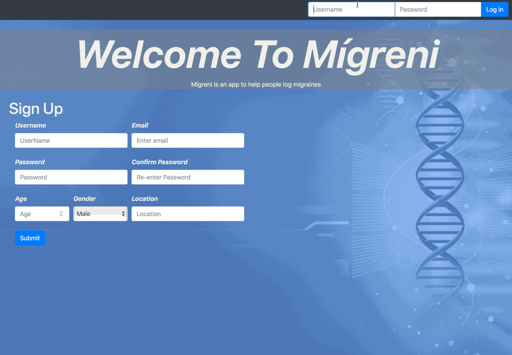

# Mígreni
A Migraine Diary App

## Purpose
Migraines are a debilitating problem for many people and current migraine diary apps fail to meet their needs in many ways

1. Asks too many questions 
2. Does not allow users to update previous migraine entries
3. No forms for doses
4. Overall, too complex

Mígreni seeks to address those issues

With Mígreni, users can create a unique account, log in, and be presented with the user page. From here, the user can log a new migraine and be asked questions about their migraine. After submitting these questions, users can click on the journal to see previous migraines with associated data. Then users can update or delete a migraine. Users can also see a line chart of their previous migraines where intensities are graphed accordingly by date. Finally, users can logout and create a new account if needs be. 

[Live site](https://glacial-fortress-86427.herokuapp.com/)

## How it works

Mígreni uses handlebars, css, bootstrap, and javascript on the front end. On the backend, Mígreni uses multiple javascript libraries such as passport, sequelize, express, body-parser and many more. Here are a list of node packages we used:

## How to fork

